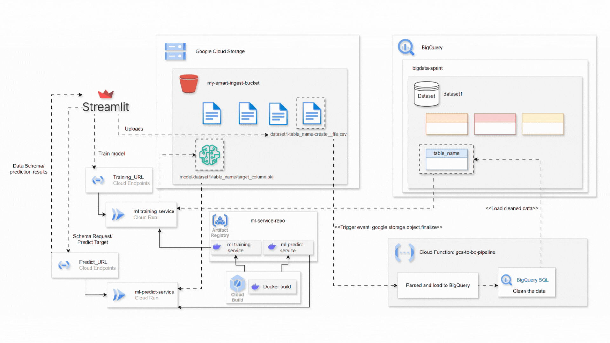

# AutoML Streamlit Application

This Streamlit application offers a seamless interface for uploading CSV files to Google Cloud Storage (GCS) and managing BigQuery datasets. The application is designed to simplify the process of importing, analyzing, and utilizing data in BigQuery, with additional support for machine learning (ML) model training and predictions.

## Features

#### 1. Upload CSV Files to GCS
- Users can easily upload CSV files to **Google Cloud Storage (GCS)**, where they can be processed and ingested into **BigQuery**.
- The application facilitates seamless data transfer, allowing users to work directly with their files without needing to leave the platform.

#### 2. Dynamic Dataset and Table Management
- After uploading the CSV file, users can view a list of existing datasets and tables in the selected **BigQuery** project.
- The app allows users to select a dataset and automatically displays the tables contained within it.
- This feature streamlines data exploration and enables quick access to relevant datasets for analysis or modeling.

#### 3. Automatic Data Ingestion into BigQuery
- Upon uploading the file, the application parses the file based on a specific naming convention:
    ```text
    dataset_name-table_name-mode__filename.csv
    ```
- A **Cloud Function** processes the file, intelligently detecting and assigning appropriate data types to each column (e.g., string, integer, float, date).
- The table is then created or updated in **BigQuery** with the correct schema, making it ready for analysis.

#### 4. ML Model Training and Retraining
- The application allows users to train or re-train machine learning models directly within **BigQuery**.
- Users can manually specify the target column for prediction, or let the system auto-detect it based on the dataset’s features.
- The system applies a **default configuration** unless the user opts to customize hyperparameters, model type, or training options.

#### 5. Prediction Interface
- After training the model, users can input feature values through the app’s intuitive interface.
- The trained model will output predictions based on the input data, with results displayed immediately.
- This feature makes it easy for users to generate predictions without writing any code or managing complex workflows.


## Cloud Architecture




## Key Benefits

- Ease of Use: No technical expertise is required to upload data, train models, or run predictions.

- Customizable Workflow: Users can tailor the configuration of the machine learning pipeline to suit their specific needs or rely on the default auto-detection for a quick setup.

- Streamlined Integration: The entire process, from data upload to prediction, is fully integrated, ensuring a smooth user experience.

## Project Structure

```text
📦bigquery-streamlit/
├── 📂prototype/
│   ├── 📂.streamlit/
│   │   └── secrets.toml          # GCP credentials and config
│   │
│   ├── 📂components/
│   │   ├── __init__.py           # Makes folder a Python package
│   │   ├── gcp_clients.py        # GCP service clients (BigQuery, Storage)
│   │   ├── navigation.py         # State management and routing
│   │   ├── prediction_form.py    # Prediction form for user input
│   │   └── train_model.py        # Training new model, retrain model functionality
│   │
│   ├── 📂pages/
│   │   ├── __init__.py           
│   │   ├── Dataset_Selection.py
│   │   ├── Table_Selection.py
│   │   ├── File_Upload.py
│   │   └── Prediction.py          
│   │
│   ├── app.py                  # Main application entry point
│   └── requirements.txt        # Python dependencies
│
├── 📂services/
│   ├── 📂Cloud_functions/
│   │   ├── 📂gcs_to_bq/
│   │   │   ├── 📂BQ_SQL/
│   │   │   │   ├── __init__.py          
│   │   │   │   ├── backup_manager.py                
│   │   │   │   ├── data_cleaner.py                  
│   │   │   │   ├── data_quality_analyzer.py   
│   │   │   │   └── validator.py 
│   │   │   ├── main.py 
│   │   │   └── Dockerfile               
│   ├── 📂ML/
│   │   ├── main.py          
│   │   ├── model_train.py          
│   │   ├── model_definition.py                  
│   │   ├── requirements.txt   
│   │   └── Dockerfile            # Exposed on Port 81       
│   ├── 📂Predict/
│   │   ├── main.py          
│   │   ├── predict.py          
│   │   ├── model_definition.py                
│   │   ├── requirements.txt   
│   │   └── Dockerfile            # Exposed on Port 81 
│   └──💲setup.sh                  # Main application entry point
│
├── 📂assets/
│   └── Demo.gif/  
├── .gitignore              # Github ignore files/folders
└── ℹ️README.md               # Project documentation
```